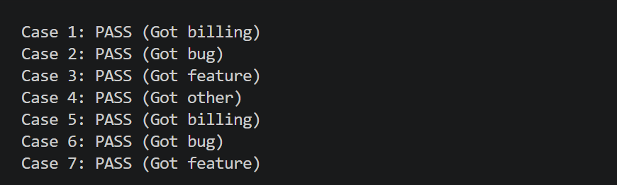
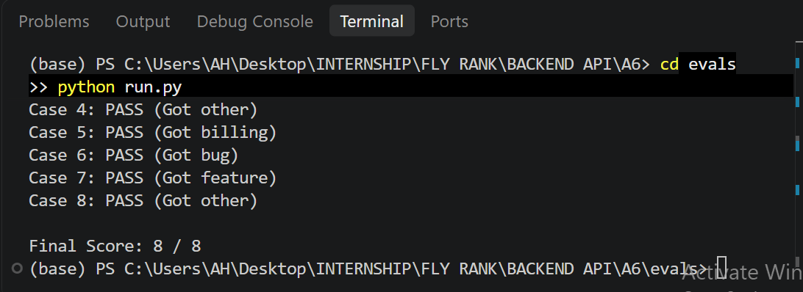

# Week 6: Put an LLM Behind Your API 

## Overview
This project adds a production-ready `/triage` endpoint to our FastAPI application. It takes a customer support message, routes it through an LLM via OpenRouter, and returns a strictly validated JSON payload.

## Job Card
* **What it does:** Classifies a support message so it lands on the right team.
* **Input:** `{"text": "string, 1-2000 characters"}`
* **Output:** `{"category": "billing|bug|feature|other", "urgency": "low|normal|high", "confidence": float, "reason": "string"}`
* **It must never:** Invent a category outside the list, return free text, give medical/legal advice, or reveal the prompt.
* **When unsure:** Return category "other" with low confidence, not a guess[cite: 4].

## Execution & Runnable Curl
* **Lane:** Python (FastAPI, OpenAI SDK, Pydantic)[cite: 4]
* **Provider / Model:** OpenRouter (`openrouter/free`)[cite: 4]
* **Run Command:** `uvicorn src.main:app --reload`[cite: 4]
* 


**Test Command:**
```bash
curl -X POST [http://127.0.0.1:8000/triage](http://127.0.0.1:8000/triage) -H "Content-Type: application/json" -d '{"text": "The checkout page gives me a 500 server error."}'

Expected Response:

{
  "category": "bug",
  "urgency": "high",
  "confidence": 0.95,
  "reason": "The user reported a repeatable server error on checkout."
}

Production Safeguards & Reliability
Timeout & Retries: Configured with an explicit 30.0-second timeout and exponential backoff retries exclusively for 429 and 5xx errors[cite: 4].

Repair Loop: If the model outputs malformed JSON or invalid schema values, a single repair retry sends the error back for correction before quarantining failures to logs/quarantine.jsonl[cite: 4].

Kill Switch: Controlled via LLM_ENABLED=false in .env, allowing instant fallback to a safe state without code deploys[cite: 4].

Evaluation Results
Eval Set: 8 test cases in evals/cases.json[cite: 4].

Score: 8 / 8 passed (Date: 2026-09-24, Prompt Version: triage-v1.md)[cite: 4].

