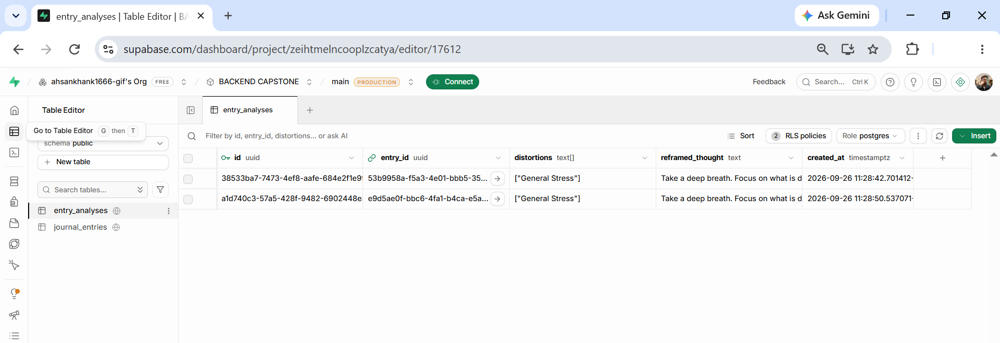

# AI-Powered CBT Journal API 🧠

**Author:** Muhammad Ahsan Khan  
**Project:** Final Capstone - FlyRank Backend AI Engineering Internship  

## Overview
An intelligent backend engine designed to process user journal entries and identify clinical cognitive distortions (such as Catastrophizing or All-or-Nothing Thinking) in real-time. Built with a modern Python stack, this API leverages Google Gemini to provide actionable psychological feedback, stores relational data securely, and dynamically generates PDF analytics reports.

## Technical Architecture
*   **Framework:** FastAPI (Python)
*   **Database:** Supabase (PostgreSQL)
*   **Caching:** Upstash Redis
*   **LLM Integration:** Google Gemini API (`gemini-1.5-flash`)
*   **Reporting:** ReportLab (PDF Generation)
*   **Containerization:** Docker

## Core Features
*   **🤖 AI Distortion Detection:** Strict prompt engineering forces the LLM to parse unstructured text into structured JSON, identifying specific cognitive roadblocks.
*   **🌱 Automated Reframing:** Generates an empathetic, constructive perspective shift for every negative entry.
*   **⚡ Sub-Millisecond Reads:** Implements Redis caching on user history endpoints to minimize database load.
*   **📊 PDF Analytics Engine:** Aggregates a user's database records to dynamically compile a downloadable PDF outlining their most frequent mental roadblocks.
*   **🐳 Production Ready:** Fully containerized with a highly optimized `Dockerfile` for seamless deployment.

## Database Schema (Supabase)
The system utilizes a relational PostgreSQL structure:
1.  `journal_entries`: Stores the user's `UUID` and `raw_text` logs.
2.  `entry_analyses`: Linked via `entry_id` foreign key. Stores the generated `distortions` array and `reframed_thought`.

## Local Setup & Installation

### 1. Clone the Repository
```bash
git clone [https://github.com/yourusername/cbt-journal-api.git](https://github.com/yourusername/cbt-journal-api.git)
cd cbt-journal-api

2. Environment Variables
Create a .env file in the root directory and add your API credentials:

SUPABASE_URL=your_supabase_url
SUPABASE_KEY=your_supabase_service_key
UPSTASH_REDIS_REST_URL=your_upstash_url
UPSTASH_REDIS_REST_TOKEN=your_upstash_token
GEMINI_API_KEY=your_gemini_key

3. Run Locally (Virtual Environment)

pip install -r requirements.txt
uvicorn main:app --reload

Access the interactive Swagger documentation at http://127.0.0.1:8000/docs.

Docker Deployment
To run the application inside an isolated Docker container:

# Build the image
docker build -t cbt-api .

# Run the container (mapping port 8000 and passing environment variables)
docker run -p 8000:8000 --env-file .env cbt-api


