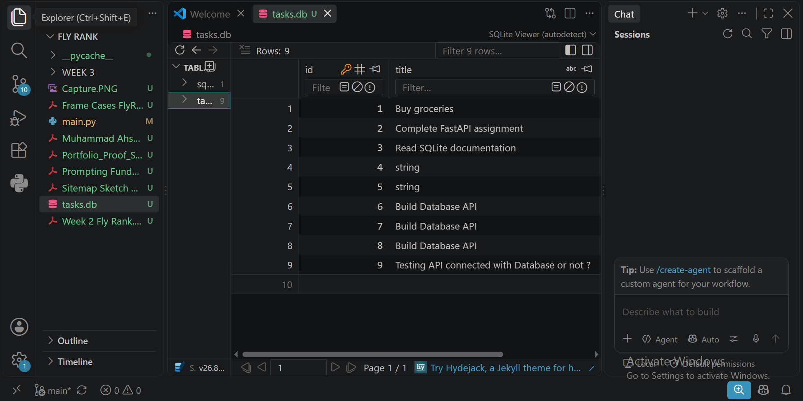
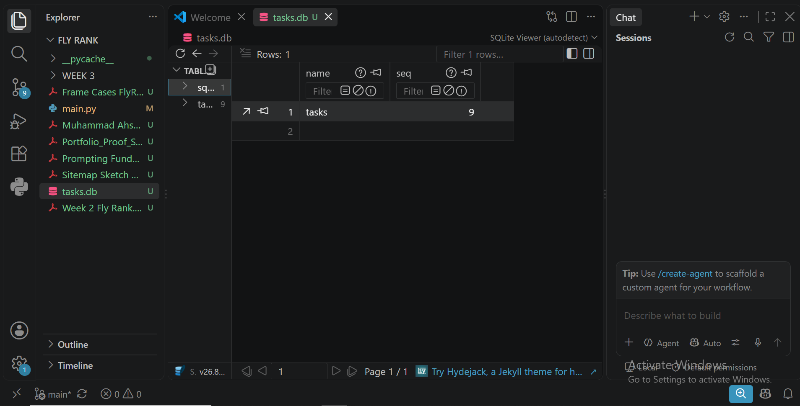

# Task Management API (SQLite Version)

An extended FastAPI backend that stores tasks in a **SQLite database** (`tasks.db`) instead of temporary in-memory storage.

---

## 💡 Why SQLite?
- **Zero-Configuration**: Requires no separate database server process.
- **File-based Persistence**: Data persists in a local file (`tasks.db`), ensuring survival across server restarts.
- **Lightweight**: Fast and ideal for embedded backends and local application development.

---

## 🗄️ Database Details
- **Database File**: `tasks.db`
- **Table Name**: `tasks`
- **Schema**:
  - `id`: `INTEGER PRIMARY KEY AUTOINCREMENT`
  - `title`: `TEXT NOT NULL`
  - `done`: `BOOLEAN NOT NULL`

---

## 🚀 How to Start the Project

1. Install dependencies:
bash
pip install fastapi uvicorn

2. Run the FastAPI server:
bash
uvicorn main:app --reload

3. Open Swagger UI Docs:
- `http://127.0.0.1:8000/docs`

---

## 🛠️ Explored SQL Queries (Stage 4)
sql
-- List all tasks
SELECT * FROM tasks;

-- Show only completed tasks
SELECT * FROM tasks WHERE done = 1;

-- Count total tasks
SELECT COUNT(*) FROM tasks;

-- Mark all tasks as completed
UPDATE tasks SET done = 1;

-- Delete all completed tasks
DELETE FROM tasks WHERE done = 1;

---

---

## 📸 Database Viewer Screenshot

